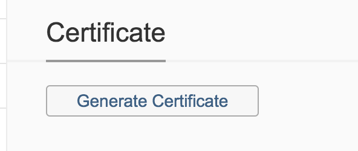
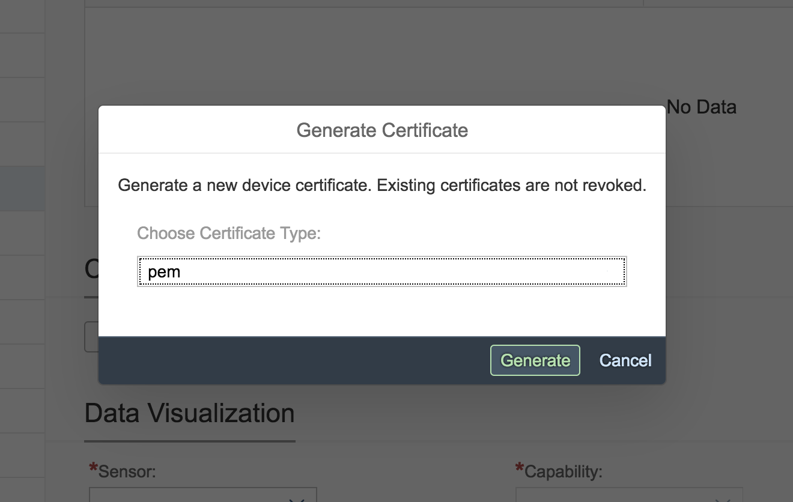

# MicroPython impl. to communicate via MQTTS with SAP CP IoT

> Please add your own certificates in the cert folder. 
> To get the certs u can simply use the ui:

> The easiest way is to use the follwing API:

curl -X GET "https:// <your iot host> /iot/core/api/v1/devices/111/authentications/clientCertificate/pem" -H "accept: application/json"

